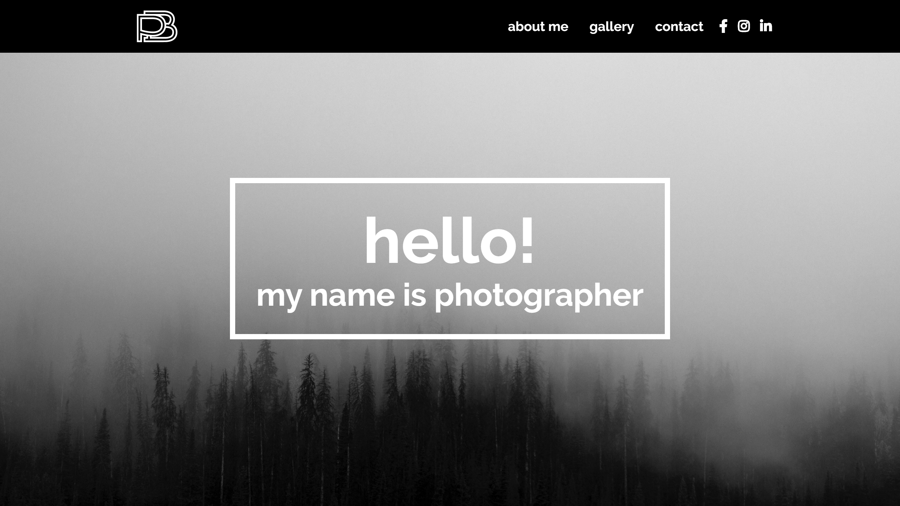
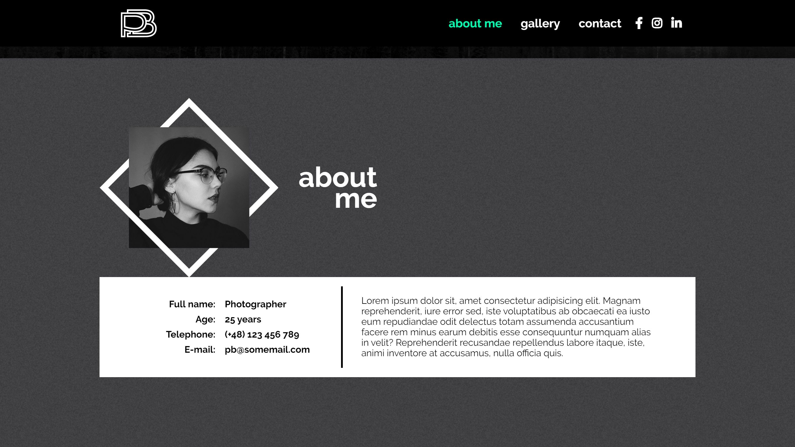
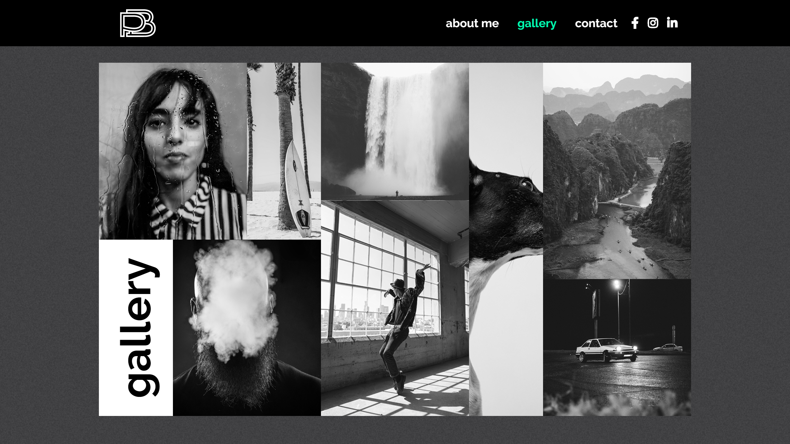
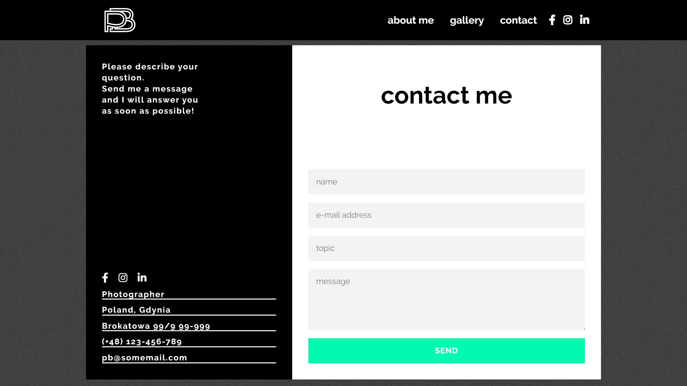

# CodersCamp - Portfolio

### Author:
Paulina Buczkowska

### General info:
This website is a simple portfolio idea for photographers with grid-based gallery, contact form and informations about owner.

### Table of content:
- Home
- About
- Gallery
- Contact

### Technologies used:
- CSS3
- HTML5

### Screenshots:

